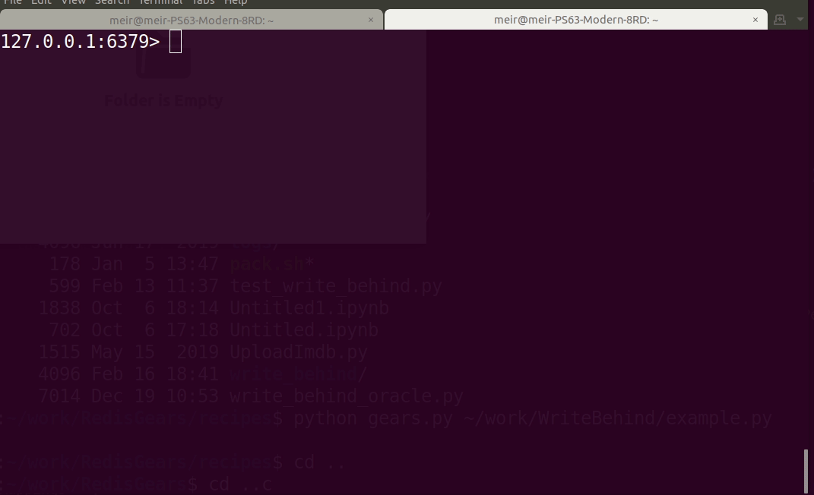

[](https://github.com/RedisGears/rgsync)

[](https://badge.fury.io/py/rgsync)
[](https://snyk.io/test/github/RedisGears/rgsync?targetFile=requirements.txt)
[](https://lgtm.com/projects/g/RedisGears/rgsync/context:python)


# RGSync
[](https://forum.redislabs.com/c/modules/redisgears)
[](https://discord.gg/6yaVTtp)

A _Write Behind_ and _Write Through_ Recipe for [RedisGears](https://github.com/RedisGears/RedisGears)

## Demo


## Example
The following is a RedisGears recipe that shows how to use the _Write Behind_ pattern to map data from Redis Hashes to MySQL tables. The recipe maps all Redis Hashes with the prefix `person:<id>` to the MySQL table `persons`, with `<id>` being the primary key and mapped to the `person_id` column. Similarly, it maps all Hashes with the prefix `car:<id>` to the `cars` table.

```python
from rgsync import RGWriteBehind, RGWriteThrough
from rgsync.Connectors import MySqlConnector, MySqlConnection

'''
Create MySQL connection object
'''
connection = MySqlConnection('demouser', 'Password123!', 'localhost:3306/test')

'''
Create MySQL persons connector
'''
personsConnector = MySqlConnector(connection, 'persons', 'person_id')

personsMappings = {
	'first_name':'first',
	'last_name':'last',
	'age':'age'
}

RGWriteBehind(GB,  keysPrefix='person', mappings=personsMappings, connector=personsConnector, name='PersonsWriteBehind',  version='99.99.99')

'''
Create MySQL cars connector
'''
carsConnector = MySqlConnector(connection, 'cars', 'car_id')

carsMappings = {
	'id':'id',
	'color':'color'
}

RGWriteBehind(GB, keysPrefix='car', mappings=carsMappings, connector=carsConnector, name='CarsWriteBehind', version='99.99.99')
```

## Running the recipe
You can use [this utility](https://github.com/RedisGears/gears-cli) to send a RedisGears recipe for execution. For example, run this repository's [example.py recipe](examples/mysql/example.py) and install its dependencies with the following command:

```bash
gears-cli --host <host> --port <post> --password <password> run example.py REQUIREMENTS rgsync PyMySQL cryptography
```

## Overview of the recipe's operation
The [`RGWriteBehind()` class](rgsync/redis_gears_write_behind.py) implements the _Write Behind_ recipe, that mainly consists of two RedisGears functions and operates as follows:
1. A write operation to a Redis Hash key triggers the execution of a RedisGears function.
1. That RedisGears function reads the data from the Hash and writes into a Redis Stream.
1. Another RedisGears function is executed asynchronously in the background and writes the changes to the target database.

### The motivation for using a Redis Stream
The use of a Redis Stream in the _Write Behind_ recipe implementation is to ensure the persistence of captured changes while mitigating the performance penalty associated with shipping them to the target database.

The recipe's first RedisGears function is registered to run synchronously, which means that the function runs in the same main Redis thread in which the command was executed. This mode of execution is needed so changes events are recorded in order and to eliminate the possibility of losing events in case of failure.

Applying the changes to the target database is usually much slower, effectively excluding the possibility of doing that in the main thread. The second RedisGears function is executed asynchronously on batches and in intervals to do that.

The Redis Stream is the channel through which both of the recipe's parts communicate, where the changes are persisted in order synchronously and are later processed in the background asynchronously.

## Controlling what gets replicated
Sometimes you want to modify the data in Redis without replicating it to the target. For that purpose, the recipe can be customized by adding the special field `#` to your Hash's fields and setting it to one of these values:
* `+` - Adds the data but does not replicate it to the target
* `=` - Adds the data with and replicates it (the default behavior)
* `-` - Deletes the data but does not replicate
* `~` - Deletes the data from Redis and the target (the default behavior when using `del` command)

When the Hash's value contains the `#` field, the recipe will act according to its value and will delete the `#` field from the Hash afterward. For example, the following shows how to delete a Hash without replicating the delete operation:

```
redis> HSET person:1 # -
```

Alternatively, to add a Hash without having it replicated:
```
redis> HSET person:007 first_name James last_name Bond age 42 # +
```

## At Least Once and Exactly Once semantics
By default the _Write Behind_ recipe provides the _At Least Once_ property for writes, meaning that data will be written once to the target, but possibly more than that in cases of failure.

It is possible to have the recipe provide _Exactly Once_ delivery semantics by using the Stream's message ID as an increasing ID of the operations. The writer RedisGears function can use that ID and record it in another table in the target to ensure that any given ID is only be written once.

All of the recipe's SQL connectors support this capability. To use it, you need to provide the connector with the name of the "exactly once" table. This table should contain 2 columns, the `id` which represents some unique ID of the writer (used to distinguish between shards for example) and `val` which is the last Stream ID written to the target. The "exactly once" table's name can be specified to the connector in the constructor via the optional `exactlyOnceTableName` variable.

## Getting write acknowledgment
It is possible to use the recipe and get an acknowledgment of successful writes to the target. Follow these steps to do so:
1. For each data-changing operation generate a `uuid`.
2. Add the operation's `uuid` immediately after the value in the special `#` field, that is after the `+`/`=`/`-`/`~` character. Enabling write acknowledgment requires the use of the special `#`.
3. After performing the operation, perform an `XREAD BLOCK <timeout> STREAMS {<hash key>}<uuid> 0-0`. Once the recipe has written to the target, it will create a message in that (`{<hash key>}<uuid>`) Stream that has a single field named 'status' with the value 'done'.
4. For housekeeping purposes, it is recommended to delete that Stream after getting the acknowledgment. This is not a must, however, as these Streams are created with TTL of one hour.

### Acknowledgment example
```
127.0.0.1:6379> hset person:007 first_name James last_name Bond age 42 # =6ce0c902-30c2-4ac9-8342-2f04fb359a94
(integer) 1
127.0.0.1:6379> XREAD BLOCK 2000 STREAMS {person:1}6ce0c902-30c2-4ac9-8342-2f04fb359a94 0-0
1) 1) "{person:1}6ce0c902-30c2-4ac9-8342-2f04fb359a94"
   2) 1) 1) "1581927201056-0"
         2) 1) "status"
            2) "done"
```

## Write Through
_Write Through_ is done by using a temporary key. The recipe registers to changes of that key and writes them to the target. Writing to the target is executed in the Server's main thread, in synchronous mode, which means that the server will be blocked at that time and the client will not get the reply until it is finished.

Writing the changes to the target may succeed or fail. If successful, the recipe renames the temporary key to its intended final name. A failure will prevent the rename. In either case, the temporary key is deleted.

The semantics of the acknowledgment Stream remains nearly the same as _Write Behind_. The only change is in the message's structure. Failed writes create a message in that (`{<hash key>}<uuid>`) Stream that has:

  * A 'status' field with the value 'failed'
  * An 'error' field containing the error's description

Note that when using _Write Through_ it is mandatory to supply a `uuid` and read the acknowledgment Stream. That is the only way to tell whether the write had succeeded.

_Write Through_ is registered using the `RGWriteThrough` class:
```python
RGWriteThrough(GB, keysPrefix, mappings, connector, name, version)
```

The `keysPrefix` argument is the prefix of the key on which the writes will be triggered. The temporary key's name will be in the following format:
```
<keysPrefix>{<realKeyName>}
```
Upon success, the key is renamed to `<realKeyName>`.

Any failure in writing to the target will cause the recipe to abort. In such cases, the temporary key is not renamed and is deleted.

Note that in some cases, such as connection failures, it is impossible to tell whether the operation had succeeded or failed on the target. The recipe considers these as failures, although in reality, the write may have succeeded.

### Example
These examples assume that the `keysPrefix` is set to "__". The first shows a successful write:

```
127.0.0.1:6379> HSET __{person:1} first_name foo last_name bar age 20 # =6ce0c902-30c2-4ac9-8342-2f04fb359a94
(integer) 4
127.0.0.1:6379> XREAD BLOCK 2000 STREAMS {person:1}6ce0c902-30c2-4ac9-8342-2f04fb359a94 0-0
1) 1) "{person:1}6ce0c902-30c2-4ac9-8342-2f04fb359a94"
   2) 1) 1) "1583321726502-0"
         2) 1) "status"
            2) "done"
127.0.0.1:6379> HGETALL person:1
1) "age"
2) "20"
3) "last_name"
4) "bar"
5) "first_name"
6) "foo"
```

An a example of a failed _Write Through_:

```
127.0.0.1:6379> HSET __{person:1} first_name foo last_name bar age 20 # =6ce0c902-30c2-4ac9-8342-2f04fb359a94
(integer) 4
127.0.0.1:6379> XREAD BLOCK 2000 STREAMS {person:1}6ce0c902-30c2-4ac9-8342-2f04fb359a94 0-0
1) 1) "{person:1}6ce0c902-30c2-4ac9-8342-2f04fb359a94"
   2) 1) 1) "1583322141455-0"
         2) 1) "status"
            2) "failed"
            3) "error"
            4) "Failed connecting to SQL database, error=\"(pymysql.err.OperationalError) (2003, \"Can't connect to MySQL server on 'localhost' ([Errno 111] Connection refused)\")\n(Background on this error at: http://sqlalche.me/e/e3q8)\""

```

### Speed Improvements
To improve the speed of write through updates, users should think about adding indexing to their write through database. This index would be created based on the column containing the *redis* key id being replicated. Using the example above, a *person_id* column will be created, regardless of the back-end database chosen for write through. As such, an index on the *person_id* column may be prudent, depending on your data volume and architecture.

## Data persistence and availability
To avoid data loss in Redis and the resulting inconsistencies with the target databases, it is recommended to employ and use this recipe only with a highly-available Redis environment. In such environments, the failure of a master node will cause the replica that replaced it to continue the recipe's execution from the point it was stopped.

Furthermore, Redis' AOF should be used alongside replication to protect against data loss during system-wide failures.

## Monitoring the RedisGears function registrations
Use [this](https://github.com/RedisGears/RedisGearsMonitor) to monitor RedisGear's function registrations.
